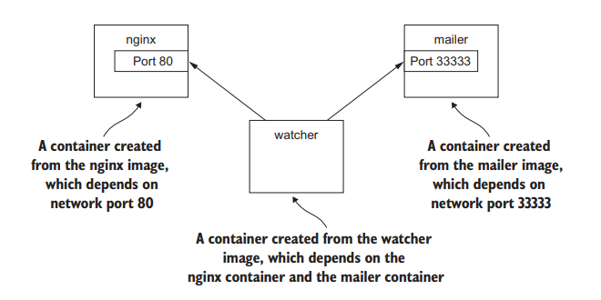

# Docker in Action

**Note**: Tài liệu này mình tham khảo từ "Docker in Action". Nó chỉ gồm các notes nhanh trong quá trình đọc của mình. Bạn nên đọc nguồn gốc để đảm bảo kiến thức. [Docker in Practive](https://www.manning.com/books/docker-in-practice-second-edition)

- [Docker in Action](#docker-in-action)
  - [Chương 2: Chạy các phần mềm trong các containers](#chương-2-chạy-các-phần-mềm-trong-các-containers)
    - [2.1 Getting help with the Docker command line](#21-getting-help-with-the-docker-command-line)
    - [2.2  Controlling containers: building a website monitor](#22--controlling-containers-building-a-website-monitor)
      - [2.2.1 Creating & starting a new container](#221-creating--starting-a-new-container)
      - [2.2.2 Running interactive containers](#222-running-interactive-containers)


## Chương 2: Chạy các phần mềm trong các containers

### 2.1 Getting help with the Docker command line
+ Nếu trong quá trình dùng docker, bạn cần các thông tin chi tiết, các options trong câu lệnh của docker thì sử dụng *help*:
    ```
    $ docker help
    ```

### 2.2  Controlling containers: building a website monitor

+ *Problem*: Khách hàng yêu cầu 1 hệ thống chạy các tác vụ trong lĩnh vực họ đang kinh doanh. Bên cạnh đó, k.h yêu cầu khi hệ thống gặp vấn đề, cần có mail thông báo đến k.h. K.h yêu cầu hệ thống dùng NGINX.
 
+ *Solution*: Hệ thống cần 3 containers. 
    - container 1: chạy NGINX, 
    - container 2: chạy chương trình gửi mail
    - container 3: đóng vai trò như quản lý container
    - Minh họa:
    
    

+ Practice:
    - Tạo containers chạy ẩn & tương tác giữa containers
    - Xem log containers
    - Dừng & khởi động lại containers
    - Reattach a terminal to a containers
    - Detach from an attached container

#### 2.2.1 Creating & starting a new container
+ Tải, cài đặt & khởi động container chạy NGINX:
    ```
    $ docker run --detach --name web nginx:latest
    $ docker run --detach --name mailer dockerinpractice/docker-mailer
    ```

    - *--detach*: để container chạy ngầm (k nhận input truyền vào & k trả ra output). Thích hợp cho các ứng dụng cần chạy ngầm liên tục.
  
#### 2.2.2 Running interactive containers
+ Để tương tác giữa các containers:
    ```
    $ docker run --interactive --tty --link web:web --name web_test busybox:latest /bin/sh
    ```

    - *--interactive*: giữ tương tác với cmd ngay cả khi không có sự kiện nào.
    - *--tty*: chỉ định 1 terminal ảo để user có thể tương tác trực tiếp với container (như với win, linux, mac)
    - */bin/sh*: bạn sử dụng shell program để giao tiếp trực tiếp với container.

+ Để check web của bạn có đang chạy:
    ```
    $ wget -O - http://web:80/
    ```

    - Terminal bây giờ sẽ hiển thị nội dung web.

+ Chạy trên máy của khách hàng:

```
$ docker run -it --name agent --link web:insideweb --link mailer:insidemailer dockerinaction/ch2_agent
```
