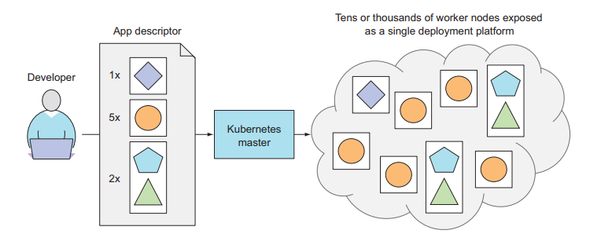
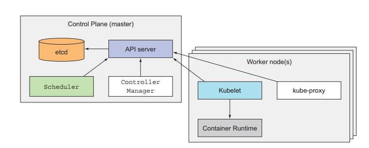

# Kubernetes in Action

**Note**: Đây là quick notes của mình trong khi đọc quyển "Kubernetes in Action - Marko Luksa". Mọi người nên đọc tài liệu gốc để đảm bảo trọn vẹn nội dung. Link: [Kubernetes in Action](https://www.manning.com/books/kubernetes-in-action)

# Contents
- [Kubernetes in Action](#kubernetes-in-action)
- [Contents](#contents)
  - [Part 1: Overview](#part-1-overview)
    - [1. Introducing Kubernetes](#1-introducing-kubernetes)
      - [1.1 Understanding the need for a system like Kubernetes ?](#11-understanding-the-need-for-a-system-like-kubernetes-)
      - [1.2 Introducing container technologies ?](#12-introducing-container-technologies-)
      - [1.3 Introducing Kubernetes ?](#13-introducing-kubernetes-)
      - [1.4 Summary](#14-summary)
    - [2. First steps with Docker & Kubernetes](#2-first-steps-with-docker--kubernetes)
      - [2.1 Creating, running & sharing a container image](#21-creating-running--sharing-a-container-image)
      - [2.2 Setting up a Kubernetes cluster](#22-setting-up-a-kubernetes-cluster)
      - [2.3 Running your first app on Kubernetes](#23-running-your-first-app-on-kubernetes)
      - [2.4 Summary](#24-summary)
  - [Part 2: Core concepts](#part-2-core-concepts)
    - [3. Pods: running containers in Kubernetes](#3-pods-running-containers-in-kubernetes)
      - [3.1 Introducing pods](#31-introducing-pods)
      - [3.2 Creating pods from YAML or JSON descriptors](#32-creating-pods-from-yaml-or-json-descriptors)
      - [3.3 Organizing pods with labels](#33-organizing-pods-with-labels)
      - [3.4 Listing subsets of pods through label selectors](#34-listing-subsets-of-pods-through-label-selectors)
      - [3.5 Using labels and selectors to constrain pod](#35-using-labels-and-selectors-to-constrain-pod)
      - [3.6 Annotating pods](#36-annotating-pods)
      - [3.7 Using namespaces to group resources](#37-using-namespaces-to-group-resources)
      - [3.8 Stopping and removing pods](#38-stopping-and-removing-pods)
      - [3.9 Summary](#39-summary)
    - [4. Replication and other controllers: deploying managed pods](#4-replication-and-other-controllers-deploying-managed-pods)
      - [4.1 Keeping pods healthy](#41-keeping-pods-healthy)
      - [4.2 Introducing replication controllers](#42-introducing-replication-controllers)
      - [4.3 Using replicaSets instead of Replication controllers](#43-using-replicasets-instead-of-replication-controllers)
      - [4.4 Running exactly one pod on each node with DaemonSets](#44-running-exactly-one-pod-on-each-node-with-daemonsets)
      - [4.5 Running pods that perform a single completable task](#45-running-pods-that-perform-a-single-completable-task)
      - [4.6 Scheduling Jobs to run periodically or once in the future](#46-scheduling-jobs-to-run-periodically-or-once-in-the-future)
    - [5. Services: enabling clients to discover and talk to pods](#5-services-enabling-clients-to-discover-and-talk-to-pods)
      - [5.1 Introducing services](#51-introducing-services)
      - [5.2 Connecting to services living outside the cluster](#52-connecting-to-services-living-outside-the-cluster)
      - [5.3 Exposing services to external clients](#53-exposing-services-to-external-clients)
      - [5.4 Exposing services externally through an Ingress resource](#54-exposing-services-externally-through-an-ingress-resource)
      - [5.5 Signaling when a pod is ready to accept connections](#55-signaling-when-a-pod-is-ready-to-accept-connections)
      - [5.6 Using a headless service for discovering individual pods](#56-using-a-headless-service-for-discovering-individual-pods)
      - [5.7 Troubleshooting services](#57-troubleshooting-services)
    - [6. Volumes: attaching disk storage to containers](#6-volumes-attaching-disk-storage-to-containers)
      - [6.1 Introducing volumes](#61-introducing-volumes)
      - [6.2 Using volumes to share data between containers](#62-using-volumes-to-share-data-between-containers)
      - [6.3 Accessing files on the worker node's filesystem](#63-accessing-files-on-the-worker-nodes-filesystem)
      - [6.4 Using persistent storage](#64-using-persistent-storage)
      - [6.5 Decoupling pods from the underlying storage technology](#65-decoupling-pods-from-the-underlying-storage-technology)
      - [6.6 Dynamic provisioning of Persistent Volumes](#66-dynamic-provisioning-of-persistent-volumes)
  - [Part 3: Beyond the basic](#part-3-beyond-the-basic)

## Part 1: Overview

### 1. Introducing Kubernetes

#### 1.1 Understanding the need for a system like Kubernetes ?

#### 1.2 Introducing container technologies ?
+ K8s sử dụng Linux container để tạo tính cô lập cho các ứng dụng. 

+ **Understanding what containers are**: 
    - Với các ứng dụng nhỏ, ngày trước người ta sử dụng VM để làm môi trường chạy ứng dụng. 
    - Nhưng khi số lượng & kích thước các ứng dụng tăng lên, việc sử dụng VM gây đến lãng phí nguồn tài nguyên. Nguyên nhân, mỗi VM cần thiết lập & quản lý độc lập.

+ ISOLATING COMPONENTS WITH LINUX CONTAINER TECHNOLOGIES:
    - Containers cho phép chạy nhiều services trên cùng một máy host nhưng vẫn đảm bảo sự *isolate*.

+ COMPARING VIRTUAL MACHINES TO CONTAINERS
    - **Update**

+ Introducing the mechanisms that make container isolation possible
    - Hai cơ chế khiến cho containers có sự *isolate*:
        - Linux Namespaces: mỗi containers có thể truy xuất thông tin các thành phần bên trong nó (files, processes, network interfaces ....)
        - Linux Control Groups: khả năng giới hạn nguồn tài nguyên mà mỗi container có thể sử dụng.

+ Isolating processes with Linux Namespaces
    - Mỗi hệ thống Linux khi được khởi tạo đều được gán 1 namespace. Khi đó, toàn bộ hệ thống bên trong đều thuộc về namespace này.
    - Nhưng bạn có thể tạo thêm namespaces cho các thành phần & tổ chức quản lý thông quan chúng.
    - Các kiểu namespaces:
        - Mount (mnt)
        - Process ID (pid)
        - Network (net)
        - Inter-process communication (ipc)
        - UTS
        - User ID (user)

+ Limiting resources available to a process
    - Việc giới hạn resource này đến từ *cgroups* - Linux kernel feature. Feature này sẽ giới hạn tài nguyên mà 1 process có thể sử dụng.

+ **Introducing the Docker container platform**
    - 
    - Understanding Docker concepts
        - 
#### 1.3 Introducing Kubernetes ?

+ **Understanding its origins**
    - *Borg* : Có thể coi là ver đầu tiên của Docker. Nó là một hệ thống nội bộ của Google, giúp các lập trình viên phát triển phần mềm & người quản lý hệ thống các ứng dụng, services.

+ **Looking at Kubernetes from the top of a mountain**
    - Kubernetes là một hệ thống phần mềm cho phép bạn dễ dàng triển khai & quản lý các ứng dụng container trên đó. Điều này giúp việc triển khai lên các hệ thống cloud phổ biến do sự đa dạng nền tảng phần cứng của các cloud.
    - K8s cho phép bạn chạy hàng ngàn ứng dụng trên các nodes tính toán (computer nodes).

    - Understanding the core of what kubernetes does
        - Hệ thống cơ bản gồm:
            - Master node
            - Worker nodes
        - Khi dev cập nhật danh sách apps lên master node, K8s giúp deploys chúng thành các nhóm worker nodes.
            - Các apps chạy cùng nhau sẽ được xếp chung vào 1 nhóm.

        

    - Helping dev focus on the core app features
        - K8s giúp dev k cần quan tâm đến các cơ sở hạ tầng bên dưới như:
            - Service discovery
            - Scaling
            - Load-balancing
            - Self-healing
            - ...

+ **Understanding the architecture of a Kubernetes cluster**

    

+ **Running an application in Kubernetes**
    - Để chạy một ứng dụng trong Kubernetes:
        - Đóng gói app vào 1 container image(s)
        - Đẩy các images này lên image registry
        - Đưa các thông tin về app (app's description) vào K8s API server. Các thông tin gồm có:
            - App components
            - Sự liên quan giữa các thành phần
            - Thành phần nào cần chạy cùng node & thành phần nào k.
            - Thông tin về thành phần nào giao tiếp nội bộ hoặc giao tiếp bên ngoài bằng địa chỉ IP.

    - **Understanding how the description results in a running container**
        - Khi xử lý app's description, *Scheduler* lên kế hoạch chỉ định các nhóm containers dựa vào tài nguyên còn lại so với tài nguyên cần thiết. (~ tuổi nhỏ làm việc nhỏ).
        - K8s trong các nodes sẽ ra lệnh cho Container Runtime kéo về & chạy các containers cần thiết.

    - **Keeping the containers running**
        - K8s liên tục đảm bảo trạng thái hoạt động của apps đúng như trong description.
            - Khi một node gặp vấn đề, K8s sẽ *restart* node đó một cách tự động

        - **Question:** restart ntn ? mô tả kĩ hơn về quá trình khắc phục này ?
        
    - **Scaling the number of copies** 
        - trong khi app đang chạy, b có thể quyết định tăng or giảm số lượng copies
        - **Question:** copies là gì ?

#### 1.4 Summary

### 2. First steps with Docker & Kubernetes

#### 2.1 Creating, running & sharing a container image

#### 2.2 Setting up a Kubernetes cluster

#### 2.3 Running your first app on Kubernetes 

#### 2.4 Summary

## Part 2: Core concepts

### 3. Pods: running containers in Kubernetes

#### 3.1 Introducing pods

#### 3.2 Creating pods from YAML or JSON descriptors

#### 3.3 Organizing pods with labels

#### 3.4 Listing subsets of pods through label selectors

#### 3.5 Using labels and selectors to constrain pod

#### 3.6 Annotating pods 

#### 3.7 Using namespaces to group resources

#### 3.8 Stopping and removing pods

#### 3.9 Summary

### 4. Replication and other controllers: deploying managed pods

#### 4.1 Keeping pods healthy

#### 4.2 Introducing replication controllers

#### 4.3 Using replicaSets instead of Replication controllers

#### 4.4 Running exactly one pod on each node with DaemonSets

#### 4.5 Running pods that perform a single completable task

#### 4.6 Scheduling Jobs to run periodically or once in the future

### 5. Services: enabling clients to discover and talk to pods

#### 5.1 Introducing services

#### 5.2 Connecting to services living outside the cluster

#### 5.3 Exposing services to external clients

#### 5.4 Exposing services externally through an Ingress resource

#### 5.5 Signaling when a pod is ready to accept connections

#### 5.6 Using a headless service for discovering individual pods

#### 5.7 Troubleshooting services

### 6. Volumes: attaching disk storage to containers

#### 6.1 Introducing volumes

#### 6.2 Using volumes to share data between containers

#### 6.3 Accessing files on the worker node's filesystem

#### 6.4 Using persistent storage

#### 6.5 Decoupling pods from the underlying storage technology

#### 6.6 Dynamic provisioning of Persistent Volumes

## Part 3: Beyond the basic